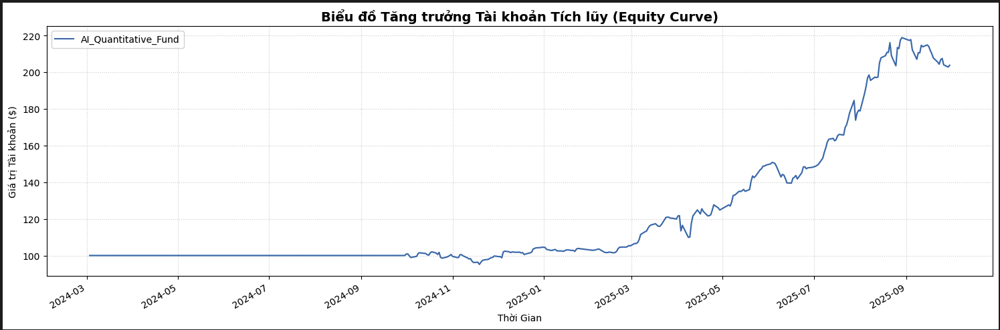

# VietStock AI-Quant Engine 🚀

> *"An end-to-end Machine Learning Quantitative Trading framework designed for the Vietnam Stock Market, featuring strict Walk-Forward validation and realistic bt engine backtesting."*

## 📖 Overview
This repository contains a full-stack algorithmic trading system. It fetches raw financial data directly from the Vietnamese market (via `vnstock` / VN30 index), applies rigorous feature engineering, and uses a suite of Machine Learning algorithms (XGBoost, LightGBM, Random Forest, Gradient Boosting) to forecast future returns. 

Instead of traditional Train/Test splits, the system operates on a professional **Walk-Forward Cross-Validation** to strictly eliminate Look-Ahead Bias. It then uses the `bt` algorithmic trading library to simulate historical capital growth (Equity Curve) and report KPIs like CAGR, Max Drawdown, and Sharpe Ratio.

---

## 🏗 System Architecture

The project strictly abides by the "Separation of Concerns" principle, mathematically isolating the "Predicting Brain" from the "Trading Arena".

1. **`src/data/data_fetcher.py` (Data Miner)**: Automatically connects to the VCI source (via vnstock API) to safely download 4 financial statements (Balance Sheet, Income Statement, Cash Flow, Ratios) without hitting API limits. It also dynamically aligns Quarterly Reports with actual Trading Prices.
2. **`src/strategies/ml_strategy.py` (The AI Brain)**: Responsible for reading historical quarters (e.g., 2021-2023) and projecting out-of-sample expected values (`y_return`) for the subsequent quarter. Outputs a **Weights Matrix** to allocate capital perfectly across Top 5 best-performing models.
3. **`src/backtest/backtest_engine.py` (The Arena)**: Blindly accepts the Weights Matrix from the AI Brain. It downloads Daily prices from VNSTOCK and executes trades exactly on schedule, yielding real-world performance metrics.
4. **`src/dashboard/app.py` (Interactive Web Dashboard)**: A simple `streamlit` application that acts as a UI for configuring the hyperparameters, picking the AI model, and visualizing the equity curve dynamics interactively in your browser.

---

## ⚡ Quick Start / Usage

### 1. Prerequisites
Ensure you have Python 3.12+ and have installed all requirements:
```bash
pip install -r requirements.txt
pip install xgboost lightgbm scikit-learn vnstock bt matplotlib seaborn
```

### 2. Running a Complete Pipeline in Jupyter Notebook (`FinRL.ipynb`)
```python
from src.strategies.ml_strategy import EnsembleMLStrategy
from src.backtest.backtest_engine import BacktestEngine

# 1. Define financial indicators to use as Features
features = ['EPS', 'BPS', 'DPS', 'cur_ratio', 'quick_ratio', 'cash_ratio', 
            'debt_ratio', 'pe', 'pb', 'roe', 'net_income_ratio']

# 2. Spin up the Machine Learning strategy (Train 12 quarters -> Predict 1 quarter)
ml_agent = EnsembleMLStrategy(df=clean_dataset, features=features, target='y_return', train_window_quarters=12)

# 3. Exectute Walk-Forward Competition across Models
leaderboard, models = ml_agent.walk_forward_competition()

# 4. Visualize the prediction vs truth line chart
ml_agent.plot_model_comparison(leaderboard)
ml_agent.analyze_ticker("FPT")

# 5. Extract the Weights Matrix from the Champion Model
weights_matrix = ml_agent.generate_weights_matrix(top_k=5, chosen_model='XGBoost')

# 6. Throw the AI's predictions into the Backtest Arena!
engine = BacktestEngine(weights_df=weights_matrix, initial_capital=10000)
engine.run_simulation()
engine.report_kpis() # Outputs Equity Curve
```

### 3. Running the Interactive Streamlit Dashboard 🖥️

If you prefer a UI instead of a Jupyter Notebook, you can launch the AI Quant Trading Dashboard directly in your browser:

```bash
streamlit run src/dashboard/app.py
```
*The dashboard provides real-time model comparisons, configurable hyperparameters (Train Quarters, Top K Stocks), exact transaction schedules, and the `bt` backtesting Equity Curve plotted natively inside the UI.*

### 4. Result

---

## 📘 Documentation
If you are coming from a Software Engineering background without prior knowledge in Quantitative Finance, reading our deep-dive documentation is **highly recommended**. It clarifies the exact *Why* behind the intense architectural decisions (Log Returns, Data Leakage, Walk-Forward Validation).

- 🇻🇳 **[Vietnamese Technical Guide](doc_vietnamese.md)** (Dành cho người mới)
- 🇬🇧 **[English Technical Guide](doc_english.md)** 

## Inspried by AI4Finacne-Foundation
- https://github.com/AI4Finance-Foundation/FinRL-Trading

## Author
- Nguyen To Binh